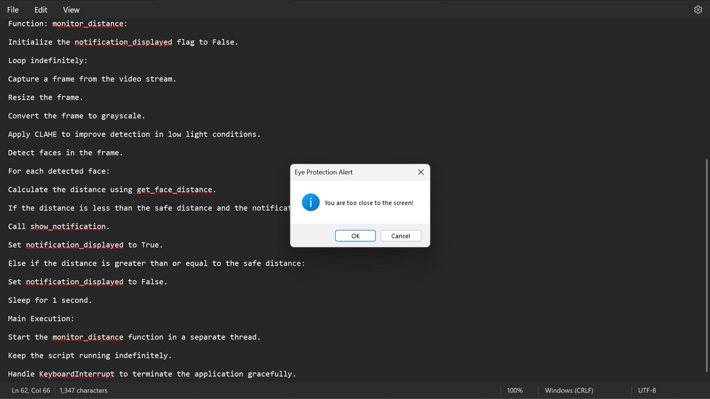

# Project Background: Eye Protection Alert System

This document summarizes the motivation and design behind EyeGuard, based on
the original project report.

## Motivation

Extended screen use is linked to Computer Vision Syndrome (CVS) — eye
strain, dryness, and discomfort. Common mitigations (blue-light filters,
brightness adjusters, break-reminder apps, posture guides) each address one
symptom, but none of them actively track **viewing distance**, which is a
major contributor to strain when users unconsciously lean in toward the
screen over a work session.

## Objective

Continuously monitor the distance between a user's face and their screen
using a standard webcam, and alert the user in real time when they sit
closer than a safe threshold — without requiring any specialized hardware.

## Original design

The initial prototype (a single Python script) worked as follows:

1. **Initialization** — import OpenCV, imutils, Tkinter, and ctypes; define a safe-distance constant.
2. **Video stream setup** — start a webcam feed via `imutils.video.VideoStream` with a short sensor warm-up delay.
3. **Face detection setup** — load OpenCV's pretrained Haar cascade face detector.
4. **Distance calculation** — convert detected face width (px) to a real-world distance (cm) via the pinhole camera formula.
5. **Notification** — when too close, pop a system-wide `MessageBoxW` alert (Windows only), gated by a background thread so it didn't block frame capture.
6. **Continuous monitoring loop** — repeat detection + distance checks on an interval, re-arming the alert once the user moved back.

## What changed in this repository

The original script was a useful proof of concept but had a few limitations
this repo addresses:

| Limitation | Resolution |
|---|---|
| Windows-only alerts (`ctypes.windll`) | Cross-platform notifications via `plyer`, with Tkinter and console fallbacks |
| Hard-coded constants | Configurable via `config.json` / environment variables |
| No grace period — alert fires the instant distance dips | `grace_period_s` requires sustained closeness before alerting |
| No cooldown — could re-alert every loop iteration | `alert_cooldown_s` throttles repeat alerts |
| Single monolithic script, no tests | Split into `detector` / `video_stream` / `notifier` / `config` / `app` modules, each independently testable |
| Hard-coded, uncalibrated focal length | `eyeguard.calibrate` computes an accurate value per webcam |
| No packaging | `pyproject.toml`, console-script entry points, CI |

## Applications

Educational institutions, offices/remote work, personal/home use, gaming,
vision-care clinics, and shared public computing spaces (libraries, internet
cafes) are all plausible deployment contexts for a lightweight, webcam-based
distance monitor like this one.

## Sample output

## References

The original report cited background reading on screen-time monitoring
behavior, posture/ergonomics, and open face-detection tooling (dlib,
facial-landmarks models) as related work. This implementation intentionally
stays on OpenCV's built-in Haar cascade to keep the dependency footprint
small; swapping in a landmark-based detector is tracked as a roadmap item.
